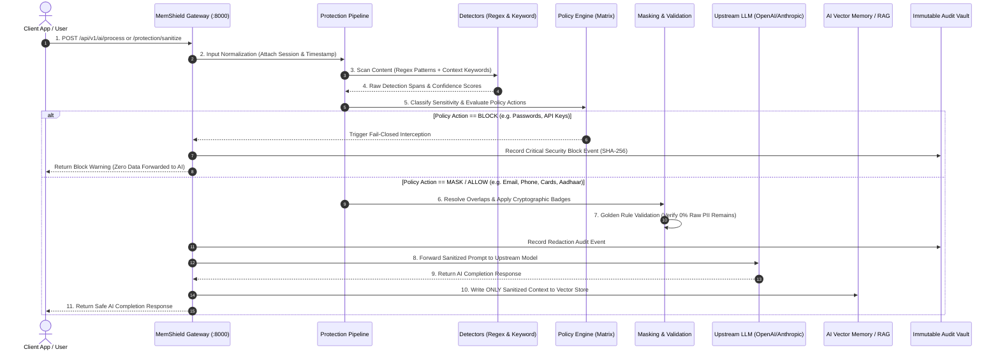

# MemShield — AI Privacy & Security Platform

> **"Your AI is protected. Your sensitive information stays private."**

---

## 🌟 Executive Summary

**MemShield** is an enterprise-grade **AI Privacy Protection Engine & Security Middleware**. It sits directly between client applications (web apps, AI assistants, developer SDKs, chat interfaces, and enterprise tools) and upstream AI systems (Large Language Models, Long-Term Vector Memory Stores, RAG Caches, and Training Buffers).

MemShield's core mission is to **detect, classify, mask, or block sensitive information (credentials, passwords, API keys, credit cards, government IDs, PII, and PHI) in real time** before it can reach AI models or persist in long-term AI memory.

---

## 📑 Complete Table of Contents

1. [Product Positioning & Boundaries](#1-product-positioning--boundaries)
2. [End-to-End Architecture & Flow](#2-end-to-end-architecture--flow)
3. [Step-by-Step Protection Pipeline](#3-step-by-step-protection-pipeline)
4. [Sensitive Data Detection Engines & Algorithms](#4-sensitive-data-detection-engines--algorithms)
5. [AI Memory Protection & Vector Defense](#5-ai-memory-protection--vector-defense)
6. [Policy Engine & 1-Click Compliance Presets](#6-policy-engine--1-click-compliance-presets)
7. [Complete UI Guide & Dashboard Walkthrough](#7-complete-ui-guide--dashboard-walkthrough)
8. [Database Schema & Multi-Tenant Data Isolation](#8-database-schema--multi-tenant-data-isolation)
9. [REST API Specification](#9-rest-api-specification)
10. [SDK & Drop-in Proxy Integration Guides](#10-sdk--drop-in-proxy-integration-guides)
11. [Project Directory Structure](#11-project-directory-structure)
12. [Installation, Setup & Testing](#12-installation-setup--testing)
13. [Client Connector Roadmap](#13-client-connector-roadmap)
14. [Security Principles & Fail-Closed Guarantee](#14-security-principles--fail-closed-guarantee)

---

## 1. Product Positioning & Boundaries

- **Product Name:** MemShield
- **Product Type:** AI Privacy & Security Platform / Privacy Middleware / AI Memory Security Layer
- **Primary UI:** Web-based Security Dashboard ([http://localhost:5173](http://localhost:5173))
- **Primary API Server:** FastAPI Engine ([http://localhost:8000](http://localhost:8000))

### 🎯 What MemShield IS:
- **Transparent Privacy Middleware:** An inline proxy that intercepts prompts, streaming tokens, and RAG contexts before forwarding them to AI models.
- **AI Memory Shield:** A firewall preventing sensitive credentials and PII from polluting vector databases (Pinecone, Chroma, Weaviate), user profile stores, and fine-tuning datasets.
- **Fail-Closed Security Layer:** An engine that automatically defaults to `BLOCK` if any security ambiguity or internal detector error occurs.

### 🚫 What MemShield IS NOT:
- **NOT** primarily a video conferencing tool or chat app (though it can secure transcripts from Zoom, Teams, or Meet via client connectors).
- **NOT** a simple regex script (it features multi-layer context-aware classification, Luhn algorithm verification, overlap resolution, and tamper-evident audit logging).

---

## 2. End-to-End Architecture & Flow

### High-Level Architecture Diagram

```
┌──────────────────────────────────────────────────────────────────────────────────┐
│                             CLIENT APPLICATIONS                                  │
│  (Enterprise Apps, AI Copilots, Chatbots, Developer SDKs, CLI Pipelines, Voice)  │
└────────────────────────────────────────┬─────────────────────────────────────────┘
                                         │ Raw Ingestion Stream / Prompts
                                         ▼
┌──────────────────────────────────────────────────────────────────────────────────┐
│                          MEMSHIELD SECURITY MIDDLEWARE                           │
│  ┌─────────────────────────┐  ┌─────────────────────────┐  ┌───────────────────┐ │
│  │ Multi-Detector Engine   │  │ Policy & Rules Engine   │  │ Masking & Redact  │ │
│  │ (Regex + Keyword/Verb)  │─▶│ (ALLOW / MASK / BLOCK)  │─▶│ Overlap Resolver  │ │
│  └─────────────────────────┘  └─────────────────────────┘  └───────────────────┘ │
│                                            │                                     │
│                                            ▼                                     │
│                          ┌───────────────────────────────────┐                   │
│                          │ Fail-Closed Validation & Auditing │                   │
│                          └───────────────────────────────────┘                   │
└────────────────────────────────────────┬─────────────────────────────────────────┘
                                         │ Sanitized Stream (0% Raw Secrets)
                                         ▼
┌──────────────────────────────────────────────────────────────────────────────────┐
│                            UPSTREAM AI & MEMORY LAYER                            │
│  ┌─────────────────────────┐  ┌─────────────────────────┐  ┌───────────────────┐ │
│  │ LLM Ingestion Gateway   │  │ Long-Term Vector Memory │  │ RAG Context &     │ │
│  │ (OpenAI, Claude, Local) │  │ (Pinecone, Chroma, DB)  │  │ Fine-Tuning Cache │ │
│  └─────────────────────────┘  └─────────────────────────┘  └───────────────────┘ │
└──────────────────────────────────────────────────────────────────────────────────┘
```

### Complete Sequence Diagram



---

## 3. Step-by-Step Protection Pipeline

Every payload entering MemShield executes through `backend/app/engine/pipeline.py`:

1. **Step 1: Input Normalization & Session Binding**  
   Encapsulates raw text, JSON payload, or transcript chunks into `NormalizedInput` with `session_id`, `actor_id`, and UTC timestamp.
2. **Step 2: Multi-Detector Scanning**  
   Executes `RegexDetector` and `KeywordDetector` in parallel. Returns structured detection spans with character offsets (`start`, `end`), confidence scores (`0.0 - 1.0`), and detector source.
3. **Step 3: Sensitivity Classification & Policy Evaluation**  
   Each entity is classified into `PUBLIC`, `INTERNAL`, `CONFIDENTIAL`, or `STRICTLY_CONFIDENTIAL`. The Policy Engine maps the data type against active rules to determine the target action (`ALLOW`, `MASK`, or `BLOCK`).
4. **Step 4: Overlap Resolution & Masking Execution**  
   `MaskingEngine.resolve_overlaps()` eliminates nested or conflicting detections by prioritizing longest character span and highest confidence score. Replaces flagged tokens with standard redaction badges (e.g., `[EMAIL REDACTED]`, `[CREDIT_CARD REDACTED]`).
5. **Step 5: Output Validation (Fail-Closed Guarantee)**  
   The Golden Rule check scans the output string to ensure that **no raw sensitive substring flagged for MASK or BLOCK exists in the final content**. If validation fails, `safe_for_ai = False` and the transaction is halted.
6. **Step 6: Cryptographic Audit Logging**  
   Logs immutable events to the audit vault containing event type, action taken, actor ID, session channel, and SHA-256 integrity hash.

---

## 4. Sensitive Data Detection Engines & Algorithms

MemShield integrates specialized pattern heuristics and algorithmic checks:

| Data Type | Detection Method | Algorithm / Validation Rule | Default Action |
| :--- | :--- | :--- | :--- |
| **PASSWORD / PIN** | Context & Assignment Verbs | `\b(password\|passwd\|pin\|cvv)\b\s*[:=]\s*["']?(.*?)["']?` | **BLOCK** |
| **API_KEY / SECRET** | Pattern & Entropy | OpenAI (`sk-proj-*`, `sk-*`), Stripe (`sk_live_*`), AWS tokens | **BLOCK** |
| **AUTH_TOKEN** | Pattern Recognition | JWT standard header signatures (`eyJhbGciOi...`) | **BLOCK** |
| **PRIVATE_KEY** | Block Delimiters | `-----BEGIN [A-Z ]*PRIVATE KEY-----[\s\S]+?-----END...` | **BLOCK** |
| **CREDIT_CARD** | Regex + Algorithmic | 13-19 digits verified with **Luhn Modulo 10 Checksum** | **MASK** |
| **AADHAAR (India)** | Structural Regex | 12 digits (`XXXX XXXX XXXX` or `XXXXXXXXXXXX`) | **MASK** |
| **PAN (India)** | Format Validator | 5 uppercase letters + 4 digits + 1 letter (`[A-Z]{5}[0-9]{4}[A-Z]`) | **MASK** |
| **EMAIL** | RFC 5322 Regex | `[A-Za-z0-9._%+-]+@[A-Za-z0-9.-]+\.[A-Za-z]{2,}` | **MASK** |
| **PHONE** | International Formats | US `(XXX) XXX-XXXX`, Indian `+91 XXXXX XXXXX`, 10-digit formats | **MASK** |
| **HEALTH_RECORD** | Keyword & Phrase Matrix | Diagnosis codes, ICD-10 identifiers, patient case records | **MASK** |

---

## 5. AI Memory Protection & Vector Defense

One of MemShield's primary innovations is dedicated **AI Memory Shielding**:

```
[User Interaction] ──▶ [MemShield Memory Guard]
                             │
            ┌────────────────┴────────────────┐
            ▼                                 ▼
   [Raw Secrets Intercepted]      [Sanitized Context Allowed]
   • API Keys Blocked             • De-identified Facts
   • Passwords Stripped           • Clean User Preferences
            │                                 │
            ▼                                 ▼
  🚫 Vector Poisoning Prevented     💾 Safe Vector Store (Pinecone / Chroma)
```

### 3 Protected Persistence Layers:
1. **Long-Term Vector Databases (Pinecone, Chroma, Weaviate, Qdrant):**  
   Prevents sensitive variables and credentials from being converted into vector embeddings and permanently recalled across future user sessions.
2. **RAG Context & Session Caches:**  
   Dynamically sanitizes retrieved document chunks before they are assembled into prompt context windows.
3. **Model Fine-Tuning & Telemetry Buffers:**  
   Guarantees that telemetry exports or conversation logs used to train future model weights contain zero PII or credentials.

---

## 6. Policy Engine & 1-Click Compliance Presets

MemShield provides instant, one-click regulatory configuration presets:

- 🏥 **HIPAA PHI Shield (Healthcare):**  
  Enforces strict masking for all Protected Health Information (PHI), patient emails, phone numbers, and full blocking of personal identifiers. (*45 CFR § 164.312*).
- 💳 **PCI-DSS v4.0 Payment Guard (Finance & Fintech):**  
  Enforces fail-closed blocking on credit cards, bank account numbers, CVVs, and cryptographic keys. (*PCI-DSS v4.0 Req 3.4*).
- 🇪🇺 **EU GDPR Privacy (General Data Protection):**  
  Enforces comprehensive pseudonymization and masking across all Direct and Indirect Personal Identifiers. (*GDPR Art. 25 & 32*).
- 🛡️ **Enterprise SOC 2 Zero-Trust (Enterprise Security):**  
  Maximum isolation profile: strictly blocks all master credentials, API keys, private certificates, and masks employee PII. (*SOC 2 Type II - CC6.1*).

---

## 7. Complete UI Guide & Dashboard Walkthrough

The web dashboard ([http://localhost:5173](http://localhost:5173)) is organized into 3 logical groups across 8 feature tabs:

```
┌────────────────────────────────────────────────────────────────────────────────────────┐
│ [HEADER]  Security Middleware: ENFORCING  |  AI Memory Shield  |  Latency: 9ms  |  [▶] │
├──────────────┬─────────────────────────────────────────────────────────────────────────┤
│ [SIDEBAR]    │ [DATA FLOW BANNER]                                                      │
│              │ "Your AI is protected. Your sensitive information stays private."       │
│ • Overview   │ Client/App  ──▶  [MemShield Sanitizer]  ──▶  Upstream AI & Memory       │
└──────────────┴─────────────────────────────────────────────────────────────────────────┘
```

### 1. Persistent Top Header & DataFlowBanner
- **Middleware Status:** Real-time indicator (`ENFORCING` vs `FAIL-OPEN`).
- **AI Memory Guard Badge:** Confirms active vector store isolation.
- **Latency Ticker:** Sub-12ms inspection overhead benchmark.
- **DataFlowBanner:** Visual interactive middleware graphic communicating core positioning.

### 2. Tab-by-Tab Breakdown
- **📊 1. Overview & Metrics (`OverviewTab`):**  
  Executive security posture cards (Status, Masked Count, Blocked Count, Memory Stops), live real-time threat stream, sensitive entity breakdown chart, and 100% regulatory compliance meters.
- **🧪 2. Protection Playground (`ProtectionPlaygroundTab`):**  
  Dual-mode interactive testbench with 1-click test scenarios (AWS key leaks, customer PII, memory injection).  
  - *Mode 1 (Raw Text Sanitizer):* Instant redaction preview with glowing badges (`[EMAIL REDACTED]`, `[PASSWORD BLOCKED]`) and confidence diagnostic chips.  
  - *Mode 2 (AI Prompt Gateway):* Intercepts prompts sent to upstream LLMs and enforces fail-closed blocking on secrets.
- **🧠 3. AI Memory Shield (`MemoryShieldTab`):**  
  Vector store defense dashboard with layer toggles (Embedding Isolation, Dynamic Scrubbing, Fine-Tuning Filter) and an interactive **Memory Poisoning Defense Testbench**.
- **⚙️ 4. Policy & Rules Engine (`PoliciesTab`):**  
  1-Click Compliance Preset switcher (HIPAA, PCI-DSS, GDPR, SOC 2) and granular entity rules table (`BLOCK`, `MASK`, `ALLOW`).
- **🗄️ 5. Session Vault (`SessionsTab`):**  
  Channel lifecycle management, inspection drilldowns with sanitized transcript diffs, and downloadable **Forensic PDF Compliance Audit Reports**.
- **📜 6. Immutable Audit Trail (`AuditLogsTab`):**  
  Searchable, filterable event ledger (`BLOCK`, `MASK`, `INITIALIZE`), CSV export, and raw JSON modal inspector with SHA-256 verification.
- **🔌 7. AI Gateway & SDK (`IntegrationsTab`):**  
  2-line drop-in proxy guides for Python OpenAI SDK, TypeScript/Node.js, and direct REST APIs.
- **🛠️ 8. Control Center (`SettingsTab`):**  
  Global Fail-Closed protection switch, sensitivity mode selector (Strict Zero-Trust vs Standard), upstream AI provider selector, audit retention settings, and Interface Visual Theme switcher.

### 3. Interface Security Theme Engine (1-Click Glowing Bulb Button)
MemShield includes a single glowing **Lightbulb (💡) toggle button** in the top header that cycles across 4 curated themes with live glowing neon feedback:
- 🌙 **Midnight Cyber (Default):** Deep Obsidian (`#070914`) with electric cyan/sky accents.
- ☀️ **Enterprise Daylight:** High-contrast clean white and slate (`#F1F5F9` / `#FFFFFF`) for daytime SOC monitors and boardroom presentations.
- 🔮 **Deep Space Indigo:** Deep night violet (`#08081B`) with electric indigo/purple glowing nodes.
- ⚡ **Matrix Zero-Trust:** Terminal Onyx (`#040D0A`) with vibrant emerald/teal accents.

---

## 8. Database Architecture: Hybrid Relational + MongoDB Atlas Vault

MemShield utilizes a **Hybrid Storage Architecture**:
1. **Relational Core (SQLite / PostgreSQL via SQLAlchemy):** Manages user accounts, authentication, session state, and granular policy matrices.
2. **Document & Vector Vault (MongoDB Atlas via Motor / PyMongo):** High-throughput, tamper-evident storage for cryptographic **Audit Logs (`audit_logs`)** with SHA-256 signatures, and sanitized **AI Vector Memory (`ai_memory`)** chunks.

```
┌─────────────────┐       ┌─────────────────┐       ┌─────────────────┐
│     users       │       │    sessions     │       │    policies     │
├─────────────────┤       ├─────────────────┤       ├─────────────────┤
│ id (UUID, PK)   │◀──┐   │ id (UUID, PK)   │◀──┐   │ id (UUID, PK)   │
│ name            │   └───│ user_id (FK)    │   └───│ owner_id (FK)   │
│ email (Unique)  │       │ source          │       │ data_type       │
│ role (ADMIN)    │       │ status          │       │ sensitivity     │
│ password_hash   │       │ total_detected  │       │ action          │
│ created_at      │       │ total_masked    │       │ enabled (Bool)  │
└─────────────────┘       │ total_blocked   │       └─────────────────┘
                          │ started_at      │
                          └────────┬────────┘
                                   │
             ┌─────────────────────┴─────────────────────┐
             ▼                                           ▼
┌─────────────────────────┐                 ┌─────────────────────────┐
│  MongoDB: audit_logs    │                 │   MongoDB: ai_memory    │
│  (Atlas Document Vault) │                 │  (Vector Context Store) │
├─────────────────────────┤                 ├─────────────────────────┤
│ _id (ObjectId)          │                 │ _id (ObjectId)          │
│ event_type              │                 │ session_id              │
│ action (MASK/BLOCK)     │                 │ safe_content            │
│ sha256_hash             │                 │ memory_status           │
│ data_type               │                 │ vector_indexed (Bool)   │
│ timestamp (ISODate)     │                 │ metadata (JSON)         │
│ metadata (JSON)         │                 │ timestamp (ISODate)     │
└─────────────────────────┘                 └─────────────────────────┘
```

---

## 9. REST API Specification

| Method | Endpoint | Description | Auth Required |
| :--- | :--- | :--- | :--- |
| `GET` | `/api/v1/health` | Service & Database health probe | No |
| `POST` | `/api/v1/auth/register` | Register enterprise security user | No |
| `POST` | `/api/v1/auth/login` | Authenticate & obtain JWT token | No |
| `GET` | `/api/v1/auth/me` | Fetch authenticated user profile | Bearer Token |
| `POST` | `/api/v1/protection/sanitize` | Primary text stream sanitization gate | Bearer Token |
| `POST` | `/api/v1/ai/process` | AI Gateway prompt proxy with policy filter | Bearer Token |
| `GET` | `/api/v1/policies` | Retrieve all data protection policies | Bearer Token |
| `PUT` | `/api/v1/policies/{id}` | Update policy action (`BLOCK`/`MASK`/`ALLOW`) | Bearer Token |
| `GET` | `/api/v1/sessions` | List all active and historical sessions | Bearer Token |
| `POST` | `/api/v1/sessions` | Create a new isolated channel session | Bearer Token |
| `POST` | `/api/v1/sessions/{id}/start` | Activate session channel | Bearer Token |
| `POST` | `/api/v1/sessions/{id}/stop` | Seal session and finalize audit logs | Bearer Token |
| `GET` | `/api/v1/dashboard` | Aggregated threat & posture metrics | Bearer Token |
| `GET` | `/api/v1/audit` | Fetch immutable audit ledger events | Bearer Token |
| `POST` | `/api/v1/outputs/{id}/pdf` | Generate and download forensic PDF report | Bearer Token |

---

## 10. SDK & Drop-in Proxy Integration Guides

### Python (OpenAI SDK 2-Line Drop-in)
```python
from openai import OpenAI

# Simply route base_url through MemShield Privacy Middleware
client = OpenAI(
    base_url="http://localhost:8000/api/v1",
    api_key="your-openai-api-key",
    default_headers={"X-MemShield-Session": "sess-prod-9021"}
)

response = client.chat.completions.create(
    model="gpt-4o-mini",
    messages=[
        {"role": "user", "content": "Analyze customer database with private credentials..."}
    ]
)
# MemShield automatically sanitizes PII and blocks raw secrets!
print(response.choices[0].message.content)
```

### TypeScript / Node.js
```typescript
import OpenAI from 'openai';

const openai = new OpenAI({
  baseURL: 'http://localhost:8000/api/v1',
  apiKey: process.env.OPENAI_API_KEY,
  defaultHeaders: {
    'X-MemShield-Policy': 'STRICT_SOC2'
  }
});

const completion = await openai.chat.completions.create({
  model: 'gpt-4o-mini',
  messages: [{ role: 'user', content: 'Debug database password...' }],
});
console.log(completion.choices[0].message.content);
```

### Direct cURL REST Ingestion
```bash
curl -X POST "http://localhost:8000/api/v1/protection/sanitize" \
  -H "Content-Type: application/json" \
  -H "Authorization: Bearer YOUR_ACCESS_TOKEN" \
  -d '{
    "session_id": "sess-prod-9021",
    "content": "My private email is alice@corp.com and key is sk-12345.",
    "source": "api_gateway"
  }'
```

---

## 11. Project Directory Structure

```
memshield/
├── apps/
│   └── web/                     # React 19 + TypeScript + Tailwind CSS Frontend
│       ├── src/
│       │   ├── components/      # Modular UI components
│       │   │   ├── Header.tsx           # Status bar, latency ticker, action buttons
│       │   │   ├── Sidebar.tsx          # Categorized navigation & profile footer
│       │   │   ├── DataFlowBanner.tsx   # Interactive visual middleware graphic
│       │   │   ├── AuthModal.tsx        # Enterprise login & demo access modal
│       │   │   └── tabs/                # 8 specialized feature dashboards
│       │   │       ├── OverviewTab.tsx              # Executive threat & compliance posture
│       │   │       ├── ProtectionPlaygroundTab.tsx  # Dual-mode sanitization & AI proxy
│       │   │       ├── MemoryShieldTab.tsx          # Vector store & RAG memory guard
│       │   │       ├── PoliciesTab.tsx              # Rules matrix & 1-click presets
│       │   │       ├── SessionsTab.tsx              # Channel vault & PDF audit generator
│       │   │       ├── AuditLogsTab.tsx             # Immutable ledger & payload inspector
│       │   │       ├── IntegrationsTab.tsx          # Drop-in SDK proxy guides
│       │   │       └── SettingsTab.tsx              # Fail-closed controls & configuration
│       │   ├── data/            # Compliance presets & benchmark scenarios
│       │   ├── services/        # API client with resilient offline fallback
│       │   ├── types/           # Strongly-typed TypeScript interfaces
│       │   ├── App.tsx          # Root application layout & state orchestrator
│       │   └── index.css        # Cyber theme styling & custom scrollbars
│       ├── index.html
│       ├── package.json
│       └── vite.config.ts
├── backend/                     # FastAPI + SQLite + SQLAlchemy Backend
│   ├── app/
│   │   ├── api/routes/          # REST API endpoints (auth, protection, sessions, ai, audit)
│   │   ├── core/                # JWT security & configuration
│   │   ├── db/                  # SQLite sessions & Base schemas
│   │   ├── engine/              # Core Privacy Protection Engine
│   │   │   ├── detector/        # Regex & Keyword sensitive entity detectors
│   │   │   ├── classifier/      # Sensitivity level classifier
│   │   │   ├── policy/          # Rule evaluator (ALLOW/MASK/BLOCK)
│   │   │   ├── masking/         # Redaction & overlap resolution
│   │   │   └── pipeline.py      # ProtectionPipeline orchestrator
│   │   └── tests/               # Pytest automated test suites
│   ├── memshield.db
│   └── requirements.txt
├── spec.md                      # Comprehensive project specifications (Source of Truth)
└── README.md                    # Complete project documentation & guide
```

---

## 12. Installation, Setup & Testing

### Prerequisites
- **Python 3.10+**
- **Node.js 18+**

### 1. Start the Backend API Engine
```bash
cd backend
pip install -r requirements.txt
uvicorn app.main:app --reload --port 8000
```
- API Documentation: [http://localhost:8000/docs](http://localhost:8000/docs)
- Health Probe: [http://localhost:8000/api/v1/health](http://localhost:8000/api/v1/health)

### 2. Start the Frontend Web Application
```bash
cd apps/web
npm install
npm run dev
```
- Web Application: [http://localhost:5173](http://localhost:5173)

### 3. Run Automated Test Suites
```bash
# Execute Backend Pytest Test Suite
cd backend
python -m pytest

# Verify Frontend Production Build
cd apps/web
npm run build
```

---

## 13. Client Connector Roadmap

While MemShield's core focus is the centralized security middleware, lightweight client connectors can route edge traffic through the engine:

- 🌐 **Browser Extension (In Development):** Intercepts ChatGPT, Claude, and internal web portals in Chrome/Edge.
- 💬 **Microsoft Teams Bot (Planned):** Sanitizes internal channel chats before AI summarization.
- 📹 **Zoom AI Companion Gate (Planned):** De-identifies live meeting transcripts in real time.
- 🏢 **Google Meet Add-on (Planned):** Enterprise PHI/PII shield for Gemini Workspace.

---

## 14. Security Principles & Fail-Closed Guarantee

1. **Zero Raw Leakage Principle:**  
   Raw sensitive tokens must **NEVER** reach an AI model or vector database when an active policy specifies `MASK` or `BLOCK`.
2. **Fail-Closed Default:**  
   If any detector encounters an internal exception, parser ambiguity, or network failure, the transaction is **immediately blocked**.
3. **Cryptographic Immutability:**  
   All security audit logs are recorded with tamper-evident SHA-256 hashes for forensic compliance audits.

---

## 📜 License
MemShield is distributed under the **Apache-2.0 License**. Built for Zero-Trust Enterprise AI Security.
